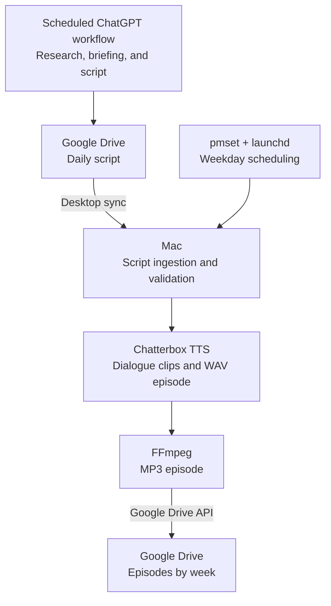

# Market Intelligence Podcast

A weekday pipeline that turns a financial-market podcast script into a two-host audio episode. Market research, the briefing, and the script are produced by a separate scheduled ChatGPT workflow. This repository handles the local audio generation and delivery.

## How it works



The Mac is scheduled to wake at **6:25 AM on weekdays**. At **6:30 AM**, a `launchd` job starts `run_daily.sh`, which keeps the Mac awake during the run. The Python pipeline retrieves that day’s script from the Google Drive desktop sync folder, validates the `HOST_A:` and `HOST_B:` dialogue, generates speech with local voice references, assembles the audio, converts it to MP3, and uploads it to Google Drive.

## What’s in this repository

| File | Purpose |
| --- | --- |
| `script_ingestion.py` | Retrieves the daily script, including cloud-file availability and retry handling |
| `generate_episode.py` | Validates dialogue and generates the WAV episode with Chatterbox TTS |
| `run_pipeline.py` | Coordinates ingestion, audio conversion, upload, and cleanup |
| `drive_upload.py` | Handles Google Drive API uploads |
| `config.py` and `.env.example` | Load and document local configuration |
| `run_daily.sh` | Runs the pipeline under `caffeinate` |
| `requirements.txt` and `requirements-lock.txt` | List direct dependencies and the resolved environment |

The pipeline uses **Python 3.11, Chatterbox TTS, PyTorch, Torchaudio, FFmpeg, Google Drive, and macOS scheduling tools**.

## Getting started

This setup currently targets **Apple Silicon Macs**. It requires Python 3.11, FFmpeg, Google Drive for desktop, Google Drive API OAuth credentials, and local voice reference files.

1. Create a Python 3.11 virtual environment and install `requirements.txt`.
2. Copy `.env.example` to `.env` and set the Drive script path, Drive folder IDs, and paths to both voice references.
3. Set up Google Drive desktop sync for incoming scripts and OAuth access for outgoing episodes.
4. With the virtual environment active, run:

   ```bash
   python run_pipeline.py
   ```

The expected input is a daily `MIP_script_YYYY-MM-DD.md` file containing lines prefixed with `HOST_A:` or `HOST_B:`. Generated clips, scripts, logs, voices, and episodes are local runtime files and are excluded from Git. The pipeline uploads the finished MP3, removes its local WAV, and cleans up older episodes.

## Current scope and next step

The scheduled research workflow lives outside this repository. Audio generation currently depends on a running Mac, Google Drive desktop sync, and private voice reference files. Credentials, tokens, `.env`, and voice files are not distributed.

**Next: move the audio pipeline to a cloud-hosted environment** so scheduled episode generation and delivery no longer depend on a personal Mac. That migration will require a replacement for desktop sync and macOS scheduling, along with cloud-compatible TTS execution, secure storage for credentials, and run monitoring.